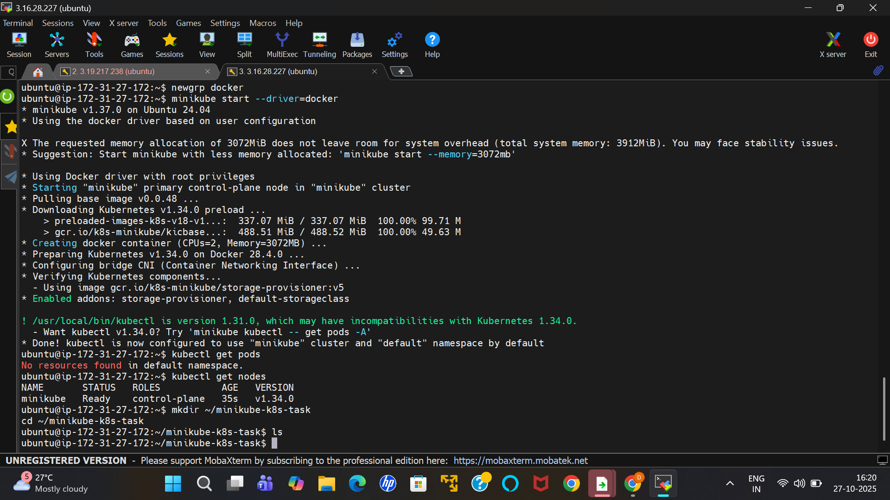
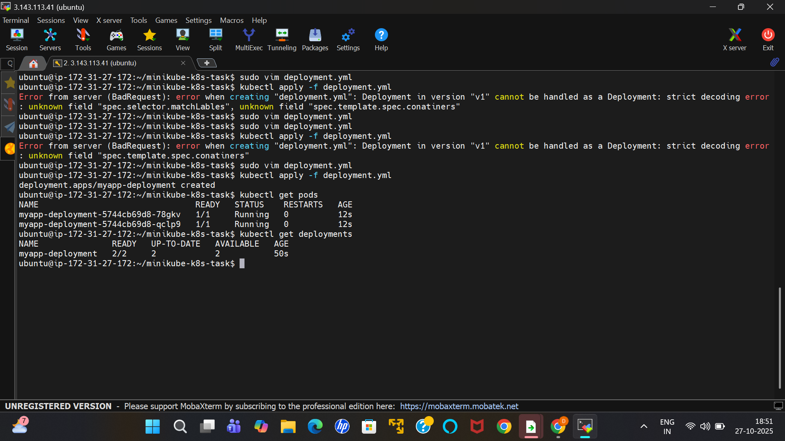
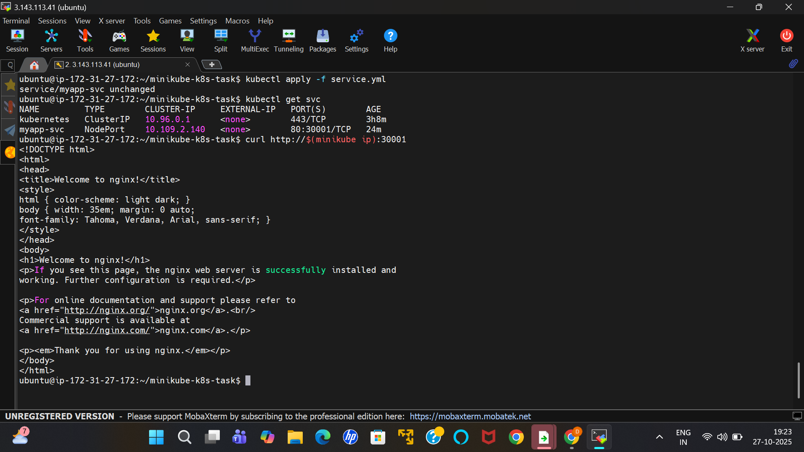
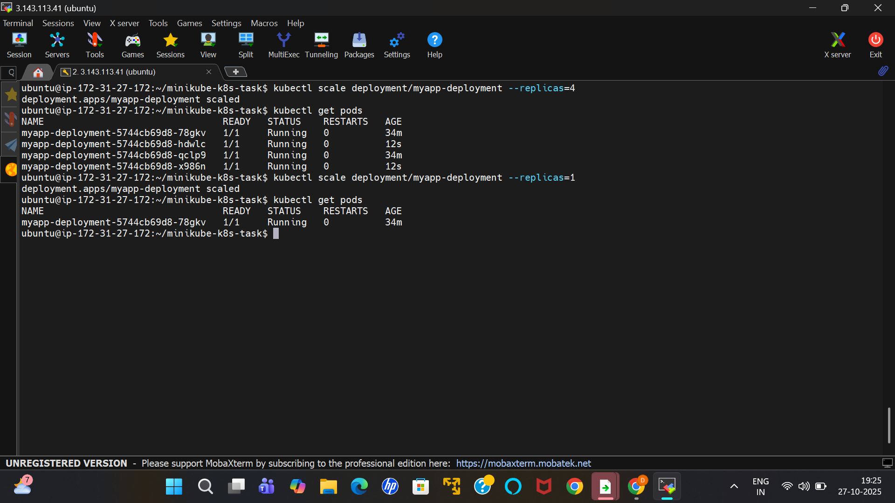
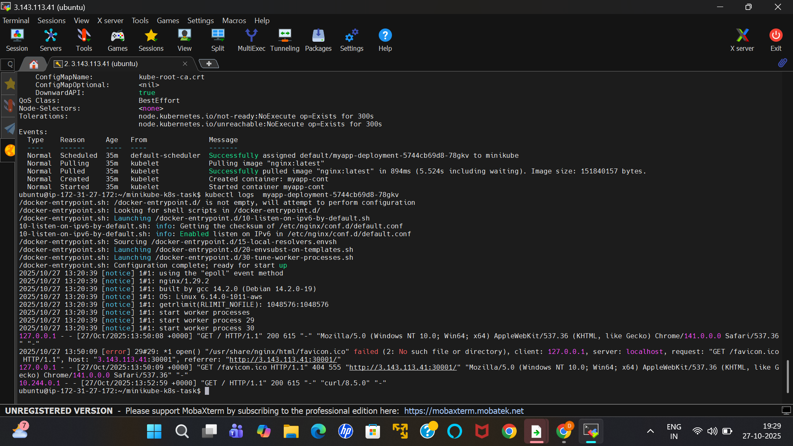
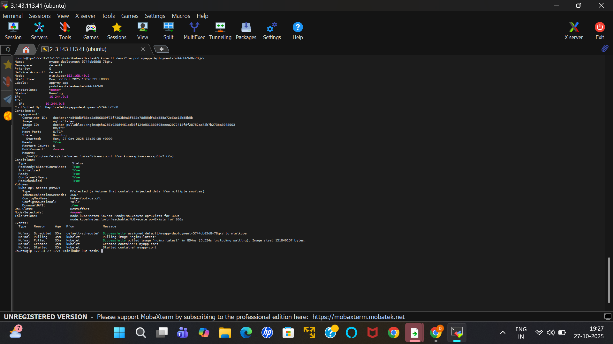

# 🚀 DevOps Internship – Task 5

## 🧩 Build a Kubernetes Cluster Locally with Minikube

### 🎯 Objective

Deploy and manage a simple Nginx application on a **local Kubernetes cluster** using **Minikube** and **kubectl** to understand the fundamentals of Kubernetes deployments, services, and scaling.

---

## 🛠️ Tools Used

* Minikube – for local Kubernetes cluster setup
* kubectl – for interacting with the cluster
* Docker – to pull and run containerized applications

---

## ⚙️ Steps Followed

### 1️⃣ Install and Start Minikube

```bash
minikube start
minikube status
```

### 2️⃣ Verify Cluster and Nodes

```bash
kubectl get nodes
kubectl cluster-info
```




### 3️⃣ Apply the deployment

```bash
kubectl apply -f deployment.yaml
```

### 4️⃣ Expose the Application via Service

```bash
kubectl apply -f service.yaml
```

### 5️⃣ Verify Deployment and Services

```bash
kubectl get pods
```

 

```bash
kubectl get svc
```

 

### 6️⃣ Access the Application

```bash
minikube service myapp-svc --url
```

or

```bash
curl http://$(minikube ip):30001
```

 

---

## 📈 Scaling the Deployment

```bash
kubectl scale deployment myapp-deployment --replicas=4
```

```bash
kubectl get pods
```

```bash
kubectl scale deployment myapp-deployment --replicas=1
```

```bash
kubectl get pods
```
 

---

## 🧾 Logs and Debugging

Check logs:

```bash
kubectl logs <pod-name>
```

 

Describe pod for details:

```bash
kubectl describe pod <pod-name>
```


 

---

## 📁 Repository Structure

.
├── deployment.yaml
├── service.yaml
├── screenshots/
│   ├── pods.png
│   ├── service.png
│   ├── nginx.png
└── README.md
```

---

## ✅ Outcome

You will understand:

* How Kubernetes handles deployments and scaling
* How Services expose applications to users
* How to debug and manage pods

